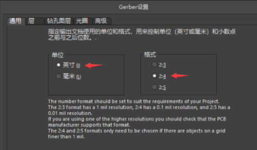
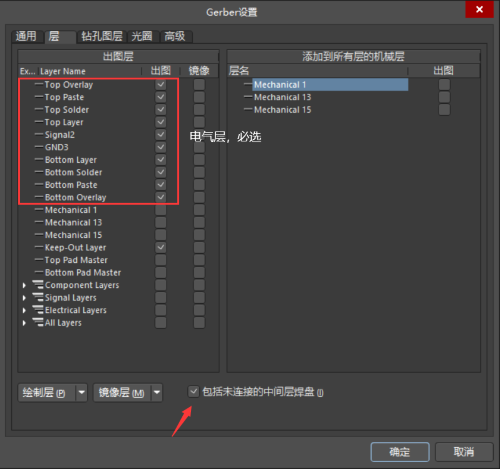
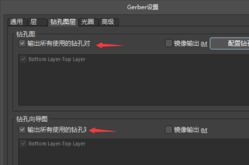
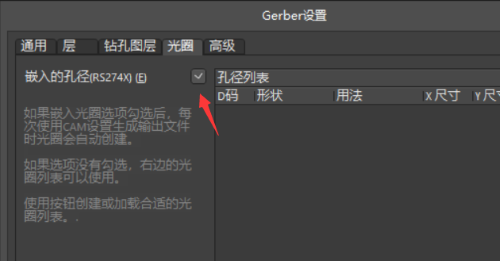
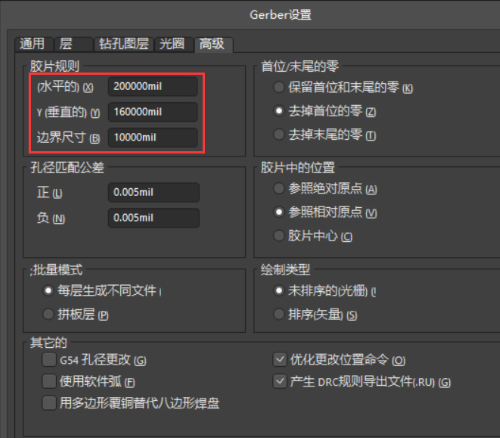
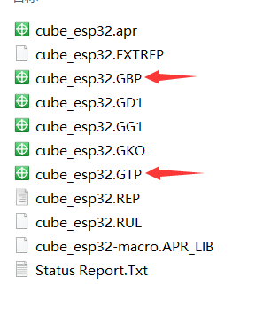

# Gerber文件导出

在PCB设计界面中，进入菜单`文件-制造输出-Gerber Files`，进入`Gerber设置`界面。  

（1）通用：单位：选择 “英寸”，格式：选择 “2:4”

  

（2）层：选择要导出的层，打板时红框内电气层必须全部导出  

  

- Top Overlay：顶层丝印层
- Top Paste：顶层钢网层
- Top Solder：顶层阻焊层
- Top Layer：顶层线路层
- Mechanical 1：机械标注1层
- Keep-Out Layer：禁止布线层

开钢网只需要导出“Top Paste”和“Bottom Paste”层即可。  

（3）钻孔图层：勾选两处“输出所有使用的钻孔对”

  

（4）光圈：勾选“RS274X”

  

（5）高级：在三个数值末尾都增加一个0

  

导出后，文件如图所示  

  
其中GTP和GBP是顶层和底层的钢网文件。  
