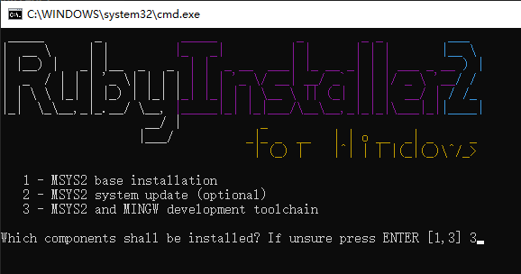

# GitHub Pages

## 安装Ruby和Jekyll

从[RubyInstaller Downloads](https://rubyinstaller.org/downloads/)下载最新Ruby+Devkit。  
安装路径不能包含空格。  
安装完成后弹出窗口安装组件MSYSS2和MINGW，选择3。  

  

安装完成后打开cmd，安装Jekyll和Bundler。  

    gem install jekyll bundler

验证安装

    jekyll -v

进入对应目录，按住shift点击鼠标右键，在此处打开Powershell，运行  

    bundle exec jekyll serve --watch

在浏览器中打开http://127.0.0.1:4000进行本地预览。  
修改内容后点击刷新即可实时查看页面。  

**问题**

> cannot load such file -- webrick  

执行`bundle add webrick`把webrick添加到依赖  

## 更换主题

[jekyllthemes.org](http://jekyllthemes.org/)